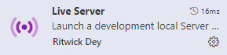

# information-training

## githubとは？

**プログラムのバージョン管理アプリケーション**

プログラムを逐次覚えておいて、それをいつでも見直すことができる

### 利点

* バージョン管理が簡単にできる
    
    プログラムをいつでも好きなタイミングで復元できる

* 共同編集が可能になる

### 使い方
1. **ソース管理**タブを選択する。
2. **メッセージ**に日付や変更内容を記載して、**コミット(commit)**を押す
3. **変更の動機(push)**を押すと完了できる　

commitは、解決した問題を記憶しておく

pusahは、変更履歴をGithub上に保存すること

pullやmargeなどもあるがそこまではできない

## Markdownとは？

**電子機器でメモを取りたい人必見！！**

### Markupとは？

HTMLなどに使われている記法、文章中に特定の文字や記号などを使って、様々な見え方の調節を行うことができる言語

### HTMLの表示方法(導入編)
1. **拡張機能**タブを選択する
2. 検索欄に[live server]と入力する

3. インストールを押す

### HTML の表示方法
1. index.html
2. 右下のGo liveをクリックする

### markdown

マークアップ言語を簡単に記述しようとする記法

マークダウン記法は「＃」や「＊」などを使って簡単にしている
。ファイル拡張子は「.md」になる